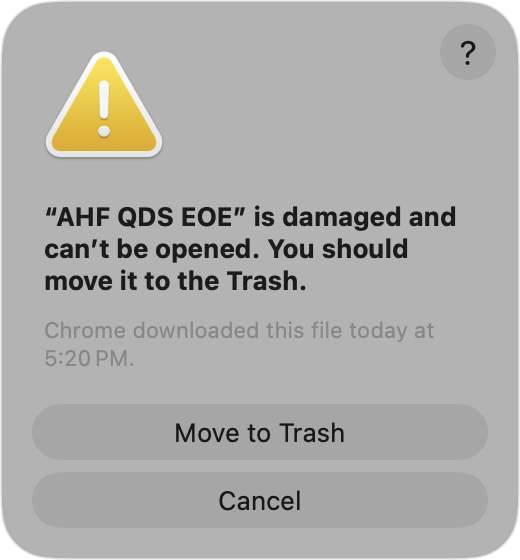

# AHF QDS EOE - Quiz Practice System

[中文](./README.zh.md) | **English**


## Project Overview

This project is designed to improve student efficiency, helping them achieve a higher level of practice performance in the same amount of time. It's perfect for practicing questions collected from various sources (Ctrl C + Ctrl V or web scraping) repeatedly until reaching an ideal memorization level, ultimately achieving better results in exams or technical interviews.

## Supported Operating Systems

- **macOS**: Supports macOS 10.12+
- **Windows**: Supports Windows 10 and 11
- **Linux**: Not yet supported

## How to Use

### 1. Download Installation Package

Download the appropriate installation package for your operating system from the repository releases.

### 2. Installation

#### Windows

Run the `.exe` installer.

#### macOS

If you encounter the security warning shown in the image, run the following command to resolve it:

```bash
xattr -rd com.apple.quarantine /Applications/AHF\ QDS\ EOE.app
```



### 3. (Optional) Get AI API Key

To use the AI import feature, obtain an API key from DeepSeek or Alibaba Cloud Bailian. Configure it in the app settings.

**Recommended**: Alibaba Bailian - offers free credits and faster responses.

- Link: `https://bailian.console.aliyun.com/`
- Note: Take advantage of free credits, but avoid paid plans if possible. More free API options will be added in the future.

## Tech Stack

Built with Next.js as the full-stack framework, packaged as a desktop application using Tauri. Tauri uses Rust as the backend, providing smaller application size and better performance. The frontend uses static export mode to ensure perfect compatibility with Tauri.

- **UI Framework**: Tailwind CSS
- **AI Integration**: Currently supports DeepSeek and Qwen (Alibaba Cloud). More AI providers may be added in the future.

## Data Storage

Since this is a web-based tech stack, data is stored in the browser's localStorage. However, because it's packaged with Tauri, the data is actually stored at:

- **Windows**: `%USERPROFILE%\AppData\Roaming\com.ahf-qds-eoe\`
- **macOS**: `~/Library/Application Support/com.ahf-qds-eoe/`

## Project Features

Many quiz platforms have poor wrong-question review features and don't allow direct export. This project solves that problem. Large language models are an excellent solution - they can not only help with conversion but also explain why an answer is correct or incorrect, rather than forcing you to memorize blindly without understanding the reasoning.

## Future Plans

### 1. Add Image Storage Support for Questions

### 2. Mobile App (in the distant future)

The project already has responsive layout, so it's ready for export. However, app storage implementation is quite complex.

---

# Developer Guide

This project uses Tauri to package as a desktop application, running on Windows, macOS, and Linux systems. If you're not a developer, simply download the package from Releases.

## Environment Requirements

### Prerequisites

- **Node.js** (18+ recommended)
- **pnpm** (package manager)
- **Rust** (1.77.2+)
- **Tauri CLI**

## Development Environment

```bash
# Install frontend dependencies
pnpm install

# Run desktop app in development mode (automatically starts frontend dev server)
pnpm tauri:dev

# Or run separately
pnpm dev          # Start Next.js dev server
cargo tauri dev   # Start Tauri dev mode
```

## Build and Package

```bash
# Build frontend and package desktop app
pnpm build:tauri

# Or execute step by step
pnpm build        # Build Next.js static files
cargo tauri build # Package Tauri app
```

The packaged application will be generated in the `src-tauri/target/release/bundle/` directory.

### Package Options

- **macOS**: Packaged as .app application and .dmg installer
- **Windows**: Packaged as .exe installer and .msi package
- **Linux**: Packaged as .deb, .rpm, and .AppImage formats

## Project Structure

```
├── src/                    # Next.js frontend code
├── src-tauri/             # Tauri backend code
│   ├── src/               # Rust source code
│   ├── icons/             # Application icons
│   ├── Cargo.toml         # Rust dependency configuration
│   └── tauri.conf.json    # Tauri app configuration
├── out/                   # Next.js static export directory
└── package.json           # Frontend dependency configuration
```

## Custom Application Configuration

### Application Icons

Icon files are located in the `src-tauri/icons/` directory:

- `icon.icns` (macOS)
- `icon.ico` (Windows)
- `icon.png` (Linux/Universal)
- `32x32.png`, `128x128.png`, `128x128@2x.png` (various sizes)

### Application Information

Modify in `src-tauri/tauri.conf.json`:

- Application name and version
- Window size and behavior
- Permissions and security settings
- Packaging options
