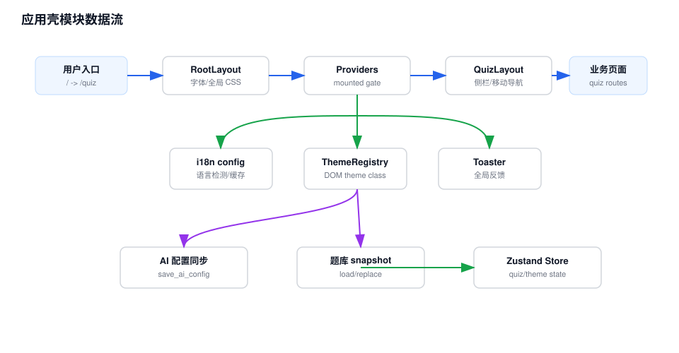

# 应用壳模块 Workflow

## 模块职责

应用壳模块负责把 Next.js 路由、全局 Provider、主题、国际化、通知和 quiz 区域导航组装起来。它不直接处理题库业务，而是提供所有业务页面运行所需的上下文。

## 关键入口

- `src/app/page.tsx`：根路径重定向到 `/quiz`。
- `src/app/layout.tsx`：加载字体、全局 CSS，并挂载 `Providers`。
- `src/components/Providers.tsx`：初始化 i18n、主题、Toaster，并在 Tauri 中同步 AI 配置和题库 snapshot。
- `src/app/quiz/layout.tsx`：提供桌面侧边栏、移动端抽屉和底部导航。

## 数据流说明

1. 用户进入应用后，根路由跳转到 `/quiz`。
2. `RootLayout` 挂载 `Providers`，等待客户端 mounted，避免 hydration mismatch。
3. `Providers` 初始化 `ThemeRegistry`、`sonner` Toaster，并在 Tauri 运行时执行两类同步：AI 配置同步到 Rust 后端、题库 snapshot 从后端加载或回写。
4. `/quiz` 下的页面通过 `QuizLayout` 获得统一导航和响应式布局。
5. 业务页面再读取 `useQuizStore`、`useThemeStore` 和 i18n 文案完成具体功能。

## 维护注意

- `Providers` 的 Tauri snapshot 同步会影响题库数据来源，修改时要确认不会覆盖本地已有题库。
- `QuizLayout` 里存在移动端与桌面端两套导航状态，新增路由时需要同时更新 `navItems`。
- 静态导出场景下不能默认依赖服务端动态能力。

