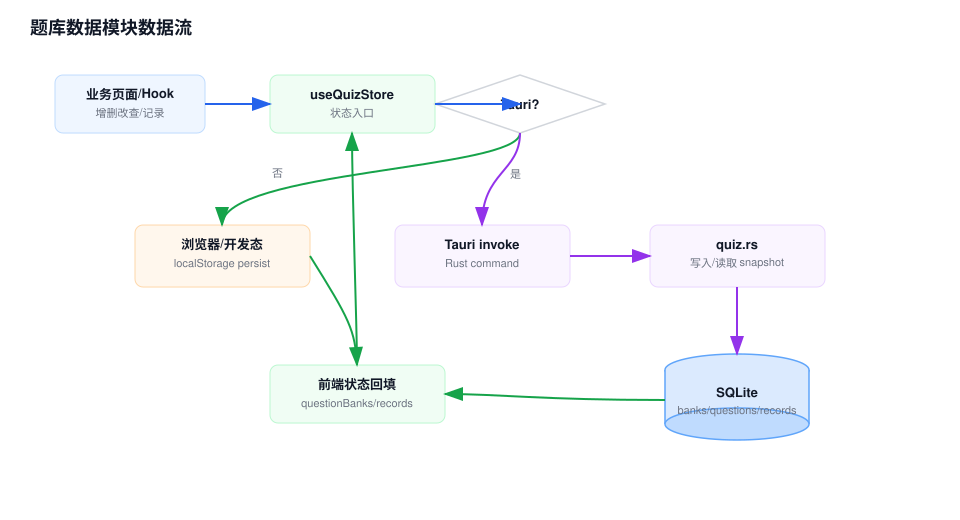

# 题库数据模块 Workflow

## 模块职责

题库数据模块维护题库、题目、答题记录、设置、转换草稿和练习会话。它是业务页面和持久化后端之间的主要边界。

## 关键入口

- `src/store/quizStore.ts`：题库、记录、设置、转换状态、练习会话和 AI 配置。
- `src/lib/storage.ts`：Zustand persist 的存储适配器。
- `src/lib/quizSnapshotSync.ts`：Tauri snapshot 加载和替换。
- `src/lib/quizQueries.ts`：重复题和搜索查询。
- `src/types/quiz.ts`：核心领域类型。

## 数据流说明

1. 页面和 hook 通过 `useQuizStore` 发起题库或记录操作。
2. `quizStore` 判断运行时环境。
3. 浏览器/开发态直接在 Zustand 状态中修改题库和记录，并由 persist 写入 `localStorage`。
4. Tauri 桌面态通过 `invoke()` 调用 Rust command，Rust 写入 SQLite 后返回完整 `QuizSnapshot`。
5. 前端用返回的 snapshot 覆盖 `questionBanks` 和 `records`，保持前后端状态一致。
6. 设置、转换状态和练习会话仍通过 Zustand persist 保存；桌面态下题库实体不再走 persist 的 partialized 数据。

## 维护注意

- 新增题库数据字段时要同时更新 TypeScript 类型、Rust 结构、SQLite 读写和导入导出格式。
- 重复题判断依赖 `normalizeQuestionContent()` 与 Rust `normalize_content()`，两边规则要保持一致。
- Tauri command 返回 snapshot 是状态一致性的关键，不要只返回局部实体后让前端自行猜测。

