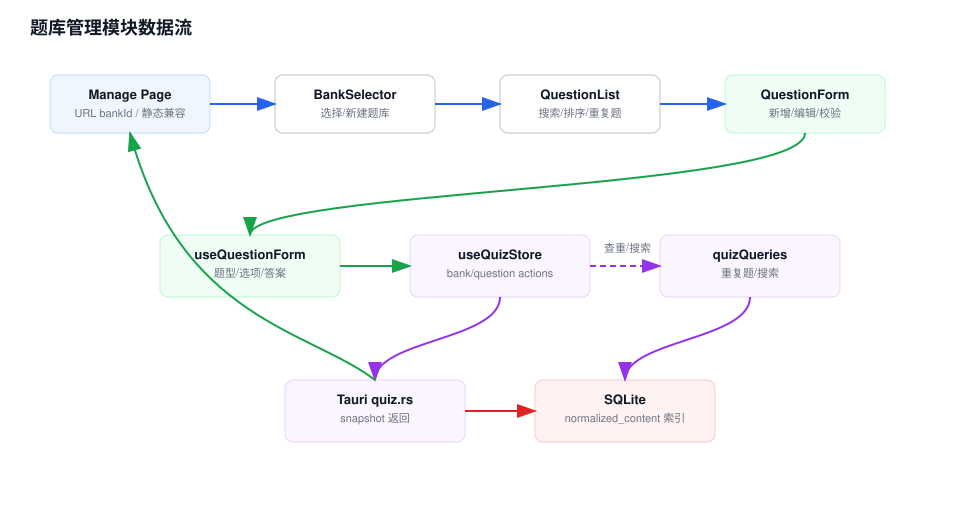

# 题库管理模块 Workflow

## 模块职责

题库管理模块提供题库创建、选择、编辑、删除，题目增删改查，题目排序搜索，以及重复题检测和批量删除。

## 关键入口

- `src/app/quiz/banks/manage/page.tsx`：主管理页，包含静态导出兼容逻辑。
- `src/app/quiz/banks/[bankId]/page.tsx`：按动态路由查看和编辑单个题库。
- `src/components/QuestionFormModal.tsx`：统一新增/编辑题目弹窗。
- `src/hooks/useQuestionForm.ts`：题目表单状态和校验。
- `src/components/quiz/manage/*`：题库选择、题目列表、重复题弹窗、删除确认弹窗。

## 数据流说明

1. 管理页读取 `questionBanks` 并通过 URL 参数恢复选中的 `bankId`。
2. 用户选择题库后，页面加载题库元数据和题目列表。
3. 新增或编辑题目时，`QuestionFormModal` 调用 `useQuestionForm` 管理字段、题型切换、选项和答案校验。
4. 表单提交后调用 `addQuestionToBank()` 或 `updateQuestionInBank()`。
5. Tauri 运行时由 Rust 写 SQLite 并返回 snapshot；浏览器开发态直接更新 Zustand。
6. 重复题检测走 `findDuplicateQuestionsInBank()`，Tauri 运行时使用后端 normalized index，浏览器态用前端 Map 聚合。

## 维护注意

- `src/app/quiz/banks/manage/page.tsx` 中的 `index.html` 兼容跳转和隐藏链接服务于静态导出，不要在未替代前删除。
- 表单校验逻辑集中在 `useQuestionForm`，新增题型时应优先修改这里。
- 搜索在 Tauri 下会叠加 `search_questions` 的后端结果，前端过滤和后端查询语义要保持一致。

