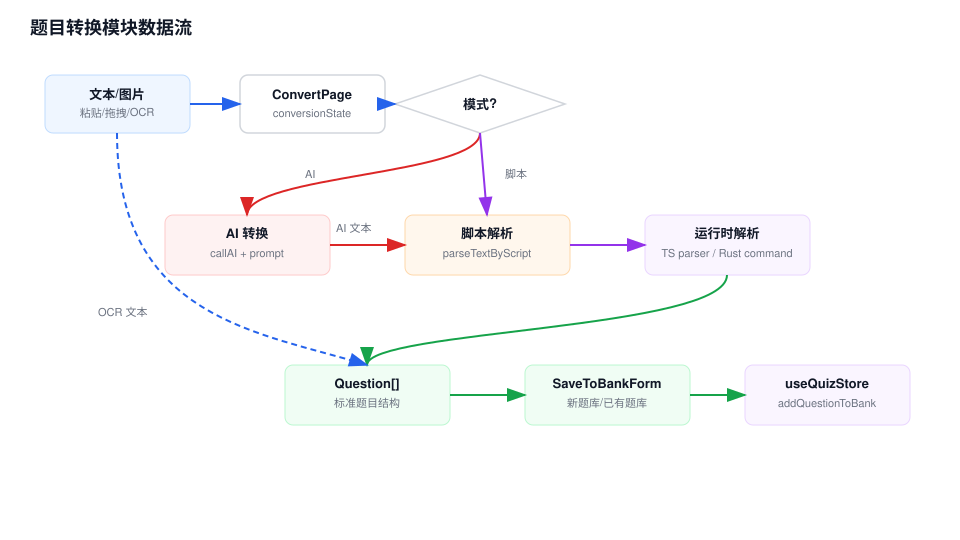

# 题目转换模块 Workflow

## 模块职责

题目转换模块把用户粘贴文本、图片 OCR 文本、AI 转换结果或固定脚本格式转换为标准 `Question[]`，再保存到新题库或已有题库。

## 关键入口

- `src/app/quiz/convert/page.tsx`：转换页面和 UI 状态。
- `src/hooks/useConversionLogic.ts`：AI 转换、脚本转换和保存到题库。
- `src/components/quiz/ImageOCRUpload.tsx`：Tesseract OCR。
- `src/utils/questionParser.ts`：AI 输出格式解析。
- `src/utils/scriptParser.ts`：脚本模板解析。
- `src/constants/ai.ts` 和 `src/constants/scriptExamples.ts`：提示词和示例模板。

## 数据流说明

1. 用户输入文本，或通过 OCR 上传/粘贴图片得到文本。
2. `ConvertPage` 保存转换草稿到 `conversionState`，避免页面切换丢失。
3. AI 模式下，`useConversionLogic` 使用当前 AI 配置调用 `callAI()`，再把 AI 返回文本交给 `parseQuestions()`。
4. 脚本模式下，输入文本直接交给 `parseTextByScript()`，按超星、通用或单选模板解析。
5. Tauri 运行时解析可以下沉到 Rust `question_parsing.rs`；浏览器态使用 TypeScript parser。
6. 用户确认后，`SaveToBankForm` 选择新建或已有题库，最终调用 store 的题库写入方法。

## 维护注意

- AI 输出 parser 对格式敏感，修改 `constants/ai.ts` 提示词时要同步跑解析测试。
- 脚本模板在 TypeScript 和 Rust 中都有实现，新增模板要同步两端。
- OCR 只产出文本，不直接创建题目；后续仍走 AI 或脚本转换流程。

