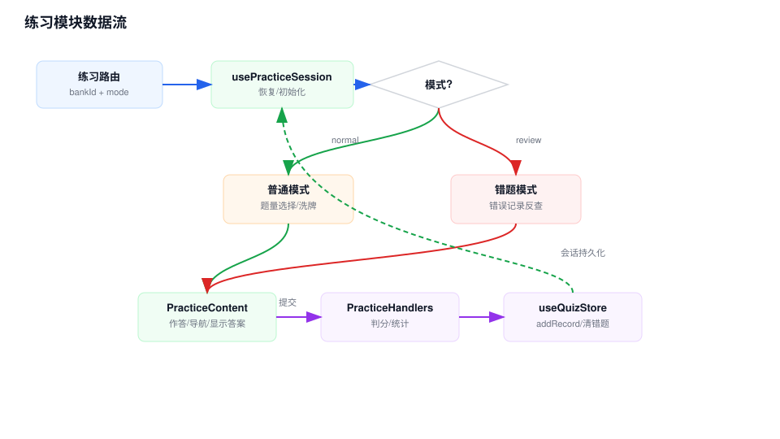

# 练习模块 Workflow

## 模块职责

练习模块负责普通刷题和错题复习模式的会话初始化、选题、作答、显示答案、跳题、提交、统计和答题记录写入。

## 关键入口

- `src/app/quiz/practice/page.tsx`：练习页面入口。
- `src/components/quiz/practice/PracticeContent.tsx`：练习主交互。
- `src/hooks/usePracticeSession.ts`：会话恢复、普通/错题模式初始化。
- `src/utils/practiceHandlers.ts`：判分、洗牌和统计。
- `src/components/quiz/practice/*`：题目展示、选项、导航、完成总结、题量弹窗。

## 数据流说明

1. 用户从首页或错题页进入 `/quiz/practice?bankId=...`，错题模式额外带 `mode=review`。
2. `usePracticeSession` 读取题库、记录、设置和已持久化的 `practiceSession`。
3. 如果存在同题库同模式的未完成会话，直接恢复；否则根据普通/错题模式初始化题目集合。
4. 普通模式弹出题量选择，错题模式从错误记录反查题目。
5. `PracticeContent` 把用户答案写入 `practiceSession.userAnswers`。
6. 提交时 `PracticeHandlers.checkIsCorrect()` 判分，并调用 `addRecord()` 写入答题记录。
7. 错题模式下答对且设置允许时，调用 `removeWrongRecordsByQuestionId()` 清除旧错题记录。

## 维护注意

- `practiceSession` 会跨页面持久化，新增会话字段时要考虑旧数据 merge 行为。
- 判分规则集中在 `PracticeHandlers`，新增题型必须补齐判分和统计测试。
- 错题复习会从全局错误记录中按当前题库过滤，修改记录结构时要检查这个反查流程。

