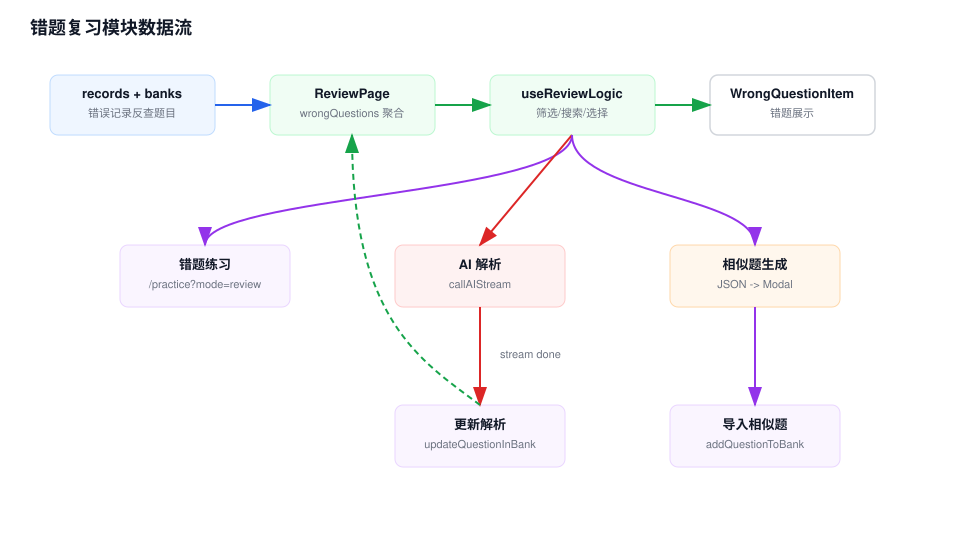

# 错题复习模块 Workflow

## 模块职责

错题复习模块把答题记录中的错误记录聚合为可复习列表，支持筛选搜索、批量选择、AI 解析、生成相似题、导入相似题和进入错题练习。

## 关键入口

- `src/app/quiz/review/page.tsx`：错题页主流程。
- `src/hooks/useReviewLogic.ts`：筛选、搜索和选择状态。
- `src/hooks/useAiExplanation.ts`：AI 流式解析。
- `src/components/quiz/WrongQuestionItem.tsx`：错题展示。
- `src/components/quiz/SimilarQuestionsModal.tsx`：相似题导入。
- `src/app/quiz/review/practice/page.tsx`：错题练习重定向页。

## 数据流说明

1. 页面读取 `questionBanks` 和 `records`。
2. 错题页筛选 `isCorrect === false` 的记录，再按 `questionId` 回查题库题目，生成带题库名和用户答案的错题视图。
3. `useReviewLogic` 根据题库过滤、搜索词和解释缓存输出 `filteredQuestions`。
4. 用户选择题目后，可以进入错题练习、批量生成 AI 解析或生成相似题。
5. AI 解析使用 `callAIStream()`，流式 chunk 更新页面展示；完成后回写题目的 `explanation`。
6. 生成相似题调用 store 中的 `generateSimilarQuestions()`，解析 AI JSON 后在弹窗中选择导入目标题库。
7. 清空错题调用 `clearRecords()`，按运行时分支清理记录。

## 维护注意

- 错题视图不是独立数据表，而是由 `records` 与 `questionBanks` 动态聚合出来。
- AI 解析使用流式接口，Tauri 桌面态依赖 `ai-stream:chunk` 和 `ai-stream:done` event。
- 相似题导入复用 `addQuestionToBank()`，会受到重复题检查设置影响。

