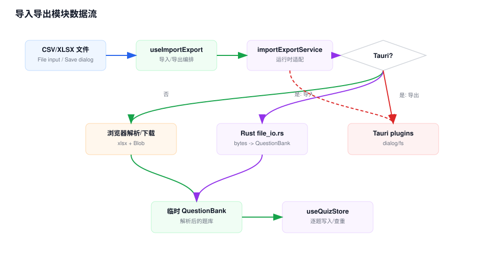

# 导入导出模块 Workflow

## 模块职责

导入导出模块支持 CSV 和 Excel 题库文件的导入、导出，既能新建题库，也能导入到已有题库并复用重复题检测。

## 关键入口

- `src/app/quiz/import-export/page.tsx`：导入导出 UI。
- `src/hooks/useImportExport.ts`：导入导出页面状态和业务编排。
- `src/services/importExportService.ts`：运行时适配和文件读写。
- `src/utils/quiz.ts`：浏览器态 CSV/XLSX 转换。
- `src-tauri/src/file_io.rs`：Tauri 桌面态 CSV/XLSX bytes 转换。

## 数据流说明

1. 导入时，用户选择 CSV/XLSX 文件和导入模式。
2. `useImportExport` 调用 `importQuestionBank()`。
3. 浏览器态通过 FileReader 和 `xlsx` 解析；Tauri 态把文件 bytes 传给 Rust command。
4. 服务层返回临时 `QuestionBank`，hook 根据模式新建题库或使用已有题库。
5. 每道题最终通过 `addQuestionToBank()` 写入，重复题会统计为 skipped。
6. 导出时，用户选择题库和格式；浏览器态生成 Blob 下载，Tauri 态通过保存对话框和 `writeFile()` 写入 Rust 生成的 bytes。

## 维护注意

- CSV/Excel 字段顺序由导入导出实现共同约定：`type`、`content`、`answer`、`explanation`、`tags`、`optionA...`。
- 桌面态和浏览器态各有一套解析/导出实现，格式变更要同步更新并补测试。
- 导入到已有题库会触发重复题检测，导入到新题库也逐题走 store 写入，不是直接替换状态。

