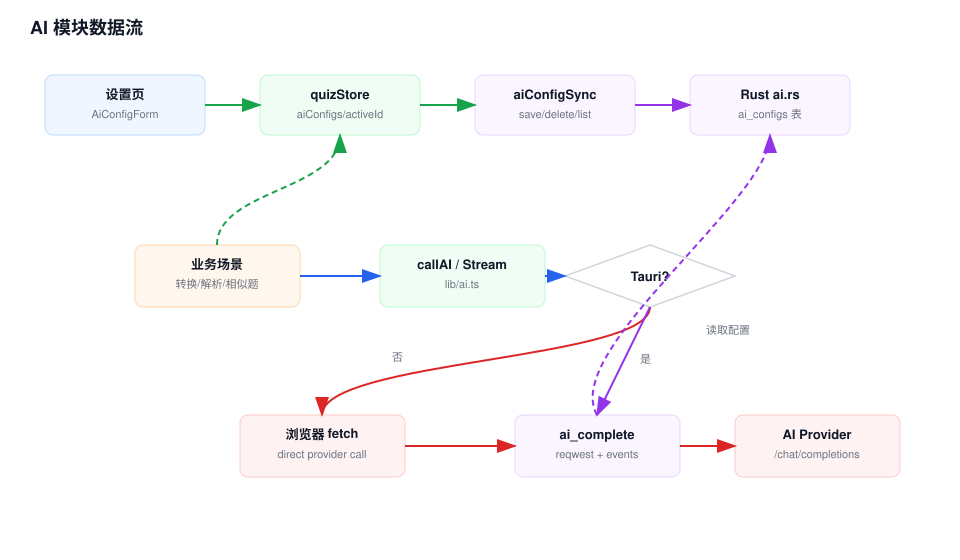

# AI 模块 Workflow

## 模块职责

AI 模块统一管理 OpenAI-compatible provider 配置，并为题目转换、错题解析和相似题生成提供非流式与流式调用能力。

## 关键入口

- `src/lib/ai.ts`：`callAI()` 和 `callAIStream()`。
- `src/lib/aiConfigSync.ts`：AI 配置与 Rust 后端同步。
- `src/store/quizStore.ts`：AI 配置状态、默认 provider 和相似题生成。
- `src/app/quiz/settings/page.tsx`：AI 配置管理 UI。
- `src-tauri/src/ai.rs`：AI 配置 SQLite 存储和代理请求。
- `src/constants/ai.ts`：转换、解析、相似题提示词。

## 数据流说明

1. 用户在设置页新增、编辑、选择或删除 AI 配置。
2. `quizStore` 更新 `settings.aiConfigs`，并在 Tauri 运行时调用 `saveAiConfigOnBackend()` 或 `deleteAiConfigOnBackend()`。
3. AI 调用发起时，`callAI()` 或 `callAIStream()` 解析当前 provider 配置。
4. 浏览器态直接 `fetch(baseUrl/chat/completions)`。
5. Tauri 态调用 Rust `ai_complete`，Rust 从 `ai_configs` 表读取配置，用 `reqwest` 请求 provider。
6. 非流式请求返回完整内容；流式请求通过 Tauri window event 向前端推送 chunk。

## 维护注意

- `baseUrl` 会自动补 `/chat/completions`，不要在 UI 侧重复拼接。
- API key 在桌面态会进入 SQLite `ai_configs`，前端只同步必要配置。
- 新增 AI 使用场景时应复用 `callAI()` 或 `callAIStream()`，避免页面直接请求 provider。

