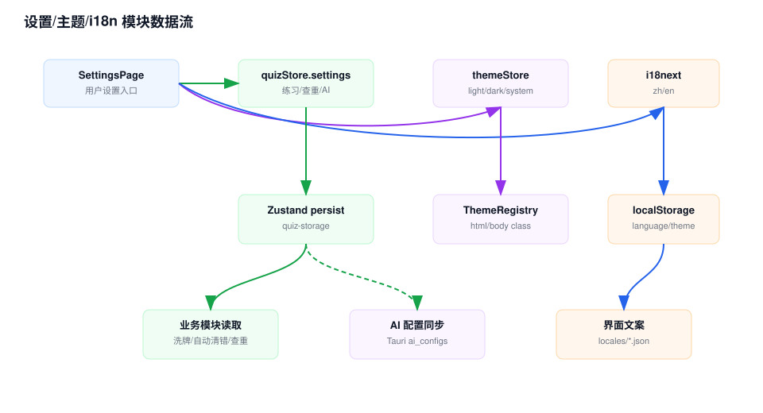

# 设置/主题/i18n 模块 Workflow

## 模块职责

设置/主题/i18n 模块负责练习偏好、重复题检查、AI 配置入口、语言切换和深浅色主题。

## 关键入口

- `src/app/quiz/settings/page.tsx`：设置页面。
- `src/store/quizStore.ts`：练习、复习、导入和 AI 设置。
- `src/store/themeStore.ts`：主题偏好。
- `src/components/ThemeRegistry.tsx`：把主题状态应用到 DOM。
- `src/i18n/config.ts`：i18next 初始化、语言检测和本地缓存。
- `src/i18n/locales/*.json`：中英文文案。

## 数据流说明

1. 设置页读取 `settings`、`theme` 和当前 i18n language。
2. 用户切换练习/复习偏好时，`setQuizSetting()` 更新 `quizStore.settings`，由 persist 保存。
3. 用户切换主题时，`themeStore` 写入 `theme-storage`，`ThemeRegistry` 同步 DOM class。
4. 用户切换语言时，`i18n.changeLanguage()` 更新 i18next，语言检测器写入 localStorage。
5. AI 配置编辑复用 AI 模块的配置写入流程。
6. 业务模块读取这些设置来决定洗牌、错题自动移除、重复题检查和 AI provider。

## 维护注意

- 设置默认值在 `initialSettings` 中，迁移逻辑也在 `quizStore.merge` 中。
- 新增文案必须同时补 `zh.json` 和 `en.json`，翻译测试会检查 key 覆盖。
- 主题是独立 store，不要混入题库 store。

