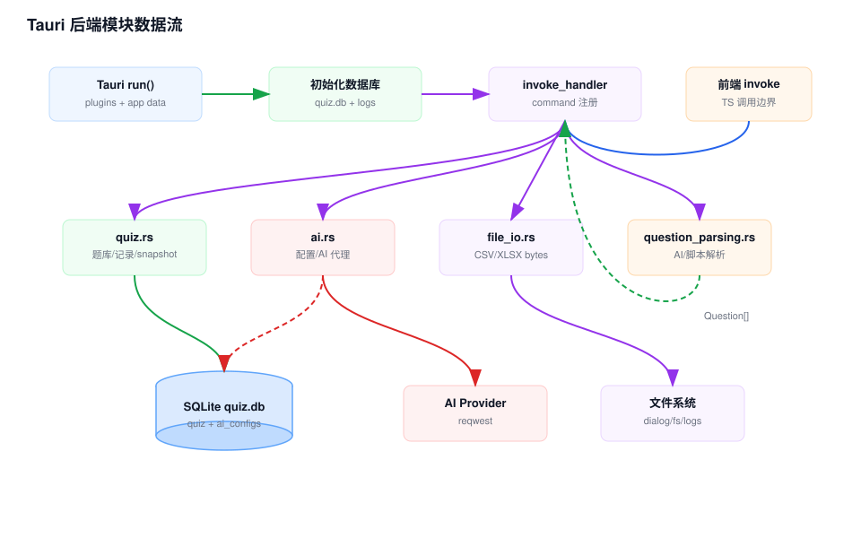

# Tauri 后端模块 Workflow

## 模块职责

Tauri 后端模块提供桌面应用外壳、插件、SQLite 初始化、Rust command、文件导入导出、AI 代理和题目解析。它是桌面态的数据权威写入点。

## 关键入口

- `src-tauri/src/lib.rs`：Tauri builder、插件注册、app data 初始化和 command 注册。
- `src-tauri/src/quiz.rs`：题库、题目、记录、重复题、搜索和 snapshot。
- `src-tauri/src/ai.rs`：AI 配置表和 AI 请求代理。
- `src-tauri/src/file_io.rs`：CSV/XLSX bytes 导入导出。
- `src-tauri/src/question_parsing.rs`：AI 输出和脚本模板解析。
- `src-tauri/tauri.conf.json`：窗口、bundle、静态前端和 devUrl 配置。

## 数据流说明

1. Tauri 启动时创建 app data 目录和 logs 目录。
2. `ai::initialize_database()` 和 `quiz::initialize_database()` 在同一个 `quiz.db` 中创建表结构和索引。
3. 前端通过 `invoke()` 调用 Rust command。
4. 题库写入 command 在 SQLite 中执行变更，并返回完整 snapshot。
5. AI command 从 `ai_configs` 读取配置，请求外部 provider，必要时通过 window event 推送流式内容。
6. 文件 command 接收前端传入的 bytes，解析或生成 CSV/XLSX bytes 后返回给前端写文件。
7. 解析 command 接收文本和模板，返回标准 `Question[]`。

## 维护注意

- SQLite schema 初始化是幂等的，新增列需要像 `normalized_content` 一样提供迁移逻辑。
- Tauri command 名称被前端字符串引用，改名需要全局同步。
- `quiz.rs` 返回 snapshot 的约定支撑前端状态一致性。
- `tauri.conf.json` 的 `frontendDist`、`devUrl` 和 `beforeBuildCommand` 与 Next 静态导出配置强绑定。

