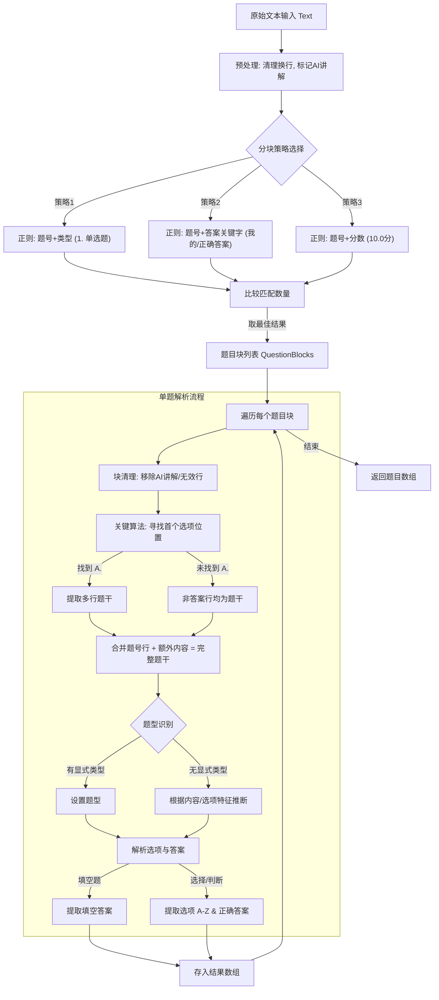

# 学习通（超星）脚本解析算法文档

本文档详细说明了项目中用于解析学习通（ChaoXing）格式题库的算法逻辑。该解析器位于 `src/utils/scriptParser.ts` 中的 `parseChaoXingTemplate` 函数。

## 核心设计理念

该解析器旨在处理非结构化的文本输入，具有高鲁棒性（Robustness），能够应对：

- **中英文混合**：支持 "单选题" / "Single Choice" 等多种关键词。
- **格式混乱**：容忍不规范的换行、空格和标点符号。
- **组合题型**：能够正确识别包含罗马数字（I, II, III）或多行描述的复杂题干。
- **干扰信息**：自动过滤 "AI 讲解"、"我的答案" 等非题目内容。

## 算法流程图

以下 Mermaid 流程图展示了从原始文本到结构化题目数据的完整处理管道：



## 详细步骤解析

### 1. 预处理 (Preprocessing)

- **统一换行符**：将 `\r\n` 替换为 `\n`。
- **保护敏感词**：将 `AI讲解` 替换为 `###AI讲解###` 标记，以便在后续步骤中精确识别并删除，防止误删或干扰分块。

### 2. 多策略分块 (Multi-Strategy Splitting)

为了适应不同页面导出的格式，采用了三种正则策略并行匹配，最终选择**匹配题目数量最多**的一种作为分块依据。

- **策略 1 (标准型)**：`(\d+\s*\.\s*\([^)]+\)[^]*?)`。寻找 "数字. (类型)" 的模式。
- **策略 2 (关键词型)**：寻找包含 "我的答案" 和 "正确答案" 的文本块。这对于没有明确题型标记的导出非常有效。
- **策略 3 (分数型)**：包含 "xx 分" 或 "score" 的文本块。

如果所有正则都失败，会回退到简单的 `split(/(?=\d+\s*\.\s*\()/ )` 暴力拆分。

### 3. 多行题干合并算法 (Multi-line Body Merging)

这是算法中最关键的部分之一，解决了 **"组合型选择题"（题干包含 I. II. III. 列表）** 被错误切割的问题。

**逻辑如下：**

1.  将题目块按行 `split`。
2.  **寻找锚点**：扫描所有行，寻找第一个严格匹配选项格式（`^A[\.．]\s+`）的行索引 `firstOptionIndex`。
3.  **提取内容**：
    - **题干第一行**：通常包含题号和类型（如 `1. (单选题) ...`）。
    - **额外内容 (Extra Content)**：从第 2 行开始，直到 `firstOptionIndex` 之前的所有行。
    - **过滤**：在提取额外内容时，会跳过包含 "我的答案"、"正确答案"、"分" 等关键字的行，防止尾部干扰信息混入题干。
4.  **合并**：`最终题干 = 清理后的第一行 + \n + 额外内容`。

**效果示例：**

```text
输入：
1. (单选题) 下列哪些是微内核特点？
I. 高效
II. 稳定
A. I, II
B. I only

处理：
- 第一行识别为题头。
- 扫描发现第 4 行是 "A. ..."。
- 第 2 行 (I.) 和第 3 行 (II.) 被识别为 "在 A 之前的非答案行"。
- 它们被合并进题干。
```

### 4. 题型推断 (Type Inference)

算法优先使用题头的显式标记（如 `(单选题)` / `(Single Choice)`）。如果缺失，则使用启发式规则：

- **填空题**：内容包含 `____` 或 "fill"。
- **多选题**：答案行包含多个字母（如 `A,B`）或 `Correct Answer` 后有多个选项。
- **判断题**：内容或答案包含 "对/错/True/False"。
- **单选题**：包含 A-D 选项且不符合上述特征的默认值。

### 5. 选项与答案提取

- **选项**：正则匹配 `^([A-Z])\.\s+(.*)$`。
- **答案**：支持多种格式，如：
  - `正确答案: A`
  - `Correct Answer: C:分时系统;` (能够智能提取出 `C`)
  - `My Answer: A` (在没有正确答案时作为备选参考，但这通常不被采纳为标准答案)
  - 判断题自动补全选项：如果只有答案 "对/True"，会自动生成 A/B 选项。

## 总结

该算法不依赖于单一的一成不变的正则，而是结合了**结构化锚点搜索（寻找选项 A）**和**启发式推断**，从而实现了对混乱文本的高可用性解析。
