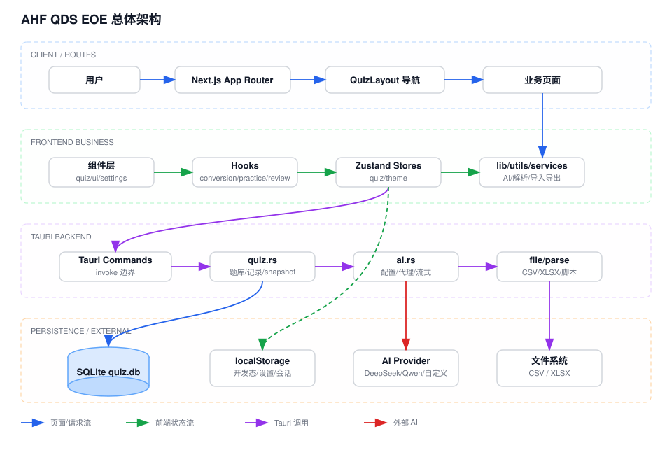

# AHF QDS EOE Architecture

## System Overview

AHF QDS EOE is a desktop-first quiz practice application. The frontend is built with Next.js 15, React 19, Tailwind CSS, and Zustand. The desktop application is packaged via Tauri 2, where a Rust backend handles SQLite persistence, AI proxy requests, question parsing, and file import/export. Next.js is configured for static export (`output: "export"`), and Tauri loads pages directly from the `out/` directory.

## Top-Level Architecture Layers

| Layer | Primary Files / Directories | Responsibilities |
| :--- | :--- | :--- |
| **App Shell & Global Providers** | `src/app/layout.tsx`, `src/components/Providers.tsx`, `src/app/quiz/layout.tsx` | Global providers, theme registration, desktop startup synchronization, i18n initialization, desktop sidebar, and responsive navigation shell. |
| **Pure Presentational UI (.tsx)** | `src/app/quiz/**/page.tsx`, `src/components/**` | Declarative UI rendering, layout, and visual structure. Free of heavy business state, direct side effects, and complex event orchestration. |
| **Co-located Companion Hooks** | `src/app/quiz/**/use*.ts`, `src/components/**/use*.ts` | Sits directly alongside the corresponding page or component. Encapsulates business workflows, local state, side effects, and event handlers. |
| **Generic Utility Hooks** | `src/hooks/useMediaQuery.ts`, `src/hooks/useDebounce.ts`, `src/hooks/index.ts` | Pure, domain-agnostic, reusable React hooks. |
| **Domain Model Layer (`@/model/*`)** | `src/model/quiz/**`, `src/model/ai/**`, `src/model/import-export/**`, `src/model/theme/**` | Domain contracts/types, backend IPC and network communications, state stores, serializers, parsers, and grading rules. Self-contained per domain module. |
| **Domain-Agnostic Utilities (`@/lib/*`)** | `src/lib/array.ts`, `src/lib/id.ts`, `src/lib/string.ts`, `src/lib/runtime.ts`, `src/lib/storage.ts` | Pure helper functions, generic storage adapters, runtime environment detection, and Tailwind utility helpers. Strictly zero business semantics. |
| **Tauri Rust Backend** | `src-tauri/src/*.rs` | Rust commands, SQLite schema management and migrations, AI streaming proxy, CSV/XLSX file byte processing, and text parsing engines. |
| **Persistence & External Systems** | SQLite, localStorage, AI Providers, File System | Application runtime data, user preferences, imported/exported files, and LLM APIs. |

## Runtime Execution Branches

The application supports dual runtimes: browser development mode and Tauri desktop mode. Several subsystems provide conditional execution paths:

- **Browser / Development Runtime**: Quiz banks and practice records are primarily stored in `localStorage` via Zustand persist middleware. AI requests are executed directly via frontend `fetch` against OpenAI-compatible `/chat/completions` endpoints.
- **Tauri Desktop Runtime**: Quiz banks and practice records invoke Rust commands via `@tauri-apps/api/core`'s `invoke()`. SQLite is located in the Tauri application data directory. AI configurations are persisted in the `ai_configs` SQLite table, and outbound LLM requests are proxied by Rust's `reqwest` client, streaming chunks back to the frontend via Tauri window events.
- **Static Export Compatibility**: `next.config.ts` enforces `output: "export"` and `trailingSlash: true`. The quiz bank management page includes fallback redirects and hidden anchor routing tags to ensure static routing compatibility within Tauri webviews.

## Core Data Model

Core domain entities and contracts are located in `src/model/quiz/quiz.contract.ts` (re-exported via `@/model/quiz`):

- `QuestionType`: `single`, `multiple`, `true_false`, `essay`, `fill_in`.
- `Question`: ID, prompt content, options, correct answer, explanation, tags, and timestamps.
- `QuestionBank`: Bank metadata (ID, title, description) and its question collection.
- `QuestionRecord`: User practice history, user answers, grading outcome, and timestamp.
- `AIConfig`: AI provider base URL, API key, model name, and custom headers (defined in `src/model/ai/ai.contract.ts`, re-exported via `@/model/ai`).

On the Rust side, `src-tauri/src/quiz.rs` maintains equivalent structs mapped to normalized SQLite tables: `question_banks`, `questions`, `question_options`, and `question_records`. AI configuration records are persisted to `ai_configs` by `src-tauri/src/ai.rs`.

## Module Documentation

Detailed workflows and data flow diagrams for each subsystem:

- [01. Application Shell Module](01_app_shell_moudle_workdflow.md)
- [02. Quiz Data Module](02_quiz_data_moudle_workdflow.md)
- [03. Bank Management Module](03_bank_management_moudle_workdflow.md)
- [04. Question Conversion Module](04_conversion_moudle_workdflow.md)
- [05. Practice Module](05_practice_moudle_workdflow.md)
- [06. Wrong Question Review Module](06_review_moudle_workdflow.md)
- [07. Import / Export Module](07_import_export_moudle_workdflow.md)
- [08. AI Module](08_ai_moudle_workdflow.md)
- [09. Settings, Theme & i18n Module](09_settings_theme_i18n_moudle_workdflow.md)
- [10. Tauri Backend Module](10_tauri_backend_moudle_workdflow.md)

## Architecture Boundaries and Dependency Rules

- **Unidirectional Dependency Flow**: UI components (`components/`, `app/`) consume domain models (`@/model/*`) and general utilities (`@/lib/*`). Domain models must **never** import UI components.
- **Strict Boundary of Model Modules**: External consumers import exclusively from the model module entry point (e.g. `@/model/quiz`, `@/model/ai`), never reaching into internal implementation files (e.g. `@/model/quiz/quiz.store`).
- **Domain-Agnostic Lib & Hook Layers**:
  - `src/lib/` must remain completely free of business domain concepts (no quiz, bank, or AI domain knowledge).
  - `src/hooks/` contains only domain-agnostic technical React hooks (e.g. `useMediaQuery`, `useDebounce`).
- **Co-located Companion Hooks**: All feature-specific state management, side effects, and event logic reside in companion hooks located directly alongside their corresponding page or component.
- **Pure Presentational UI**: `.tsx` files focus solely on layout and presentation. Complex effects, state machines, and handler callbacks are delegated to companion hooks.
- **Authoritative Backend Data Source**: In desktop mode, SQLite via `src-tauri/src/quiz.rs` is the authoritative source of truth. Desktop mutations return an updated `QuizSnapshot` which is hydrated into the frontend Zustand store to guarantee state consistency.
- **Dual Parser & Serializer Parity**: Question parsing and import/export serializers are implemented both in TypeScript (for web/fallback) and Rust (for desktop performance). Schema changes must maintain parity across both implementations with corresponding test coverage.
- **Co-located Tests**: Test files (`*.test.ts`) are placed directly next to their target source files without standalone `__tests__` directories.
