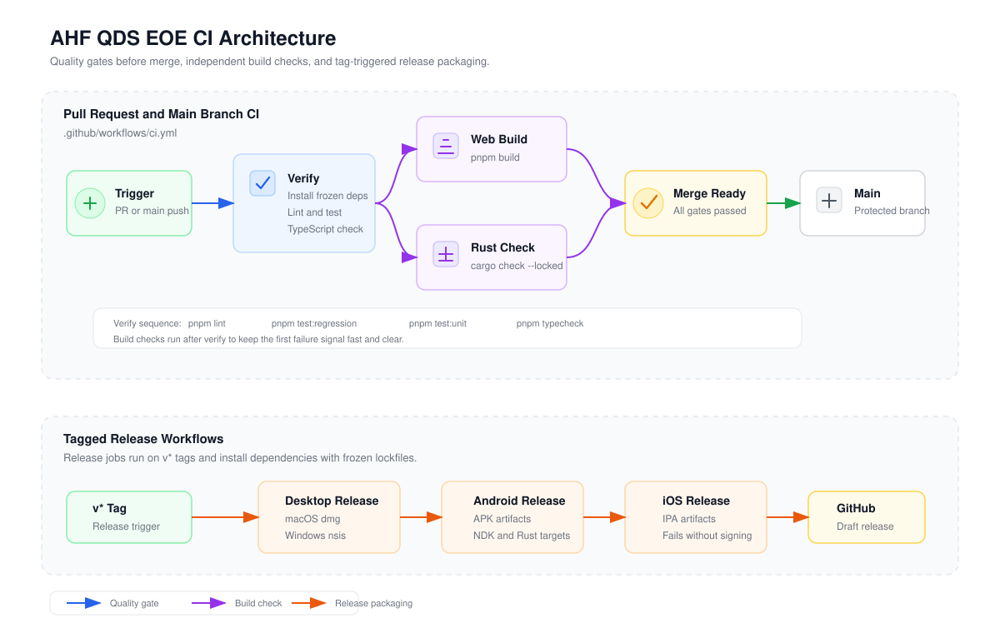

# CI Design

This project uses GitHub Actions to separate pull request quality gates from tagged release packaging. The goal is to catch common regressions before merge while keeping platform packaging in release-specific workflows.

## Goals

- Fail pull requests on lint, regression tests, unit tests, type errors, and broken static export builds.
- Check the Tauri Rust backend independently from platform packaging.
- Keep dependency installation reproducible with `pnpm install --frozen-lockfile` and locked Cargo resolution.
- Keep release workflows aligned with CI versions for Node.js and pnpm.
- Avoid silent release failures.

## Pull Request Pipeline

The main CI workflow is `.github/workflows/ci.yml`.

The source diagram is maintained at `docs/assets/ci-architecture.svg`, with an exported PNG copy at `docs/assets/ci-architecture.png` for tools that do not render SVG.

The `verify` job is intentionally fast and runs first. It blocks the heavier build checks until the code has already passed linting, tests, and TypeScript validation. The `web-build` job confirms that Next.js static export still builds. The `rust-check` job confirms that the Tauri backend compiles without producing platform release artifacts.

## Test Layers

- `pnpm test:regression` covers high-value product flows that should not regress, currently quiz parsing and CSV/Excel import-export round trips.
- `pnpm test:unit` covers focused utility-level tests.
- `pnpm test` remains available for running the full Vitest suite locally.

## Release Pipeline

Tagged releases use dedicated workflows:

- `.github/workflows/release-desktop.yml` builds macOS and Windows desktop artifacts.
- `.github/workflows/release-android.yml` builds Android APK artifacts.
- `.github/workflows/release-ios.yml` builds iOS artifacts and now fails when signing or build configuration is missing.

Release workflows use the same Node.js major version and pnpm major version as CI. They also install dependencies with `--frozen-lockfile` so tagged release builds are reproducible.

## Operational Notes

- CI runs on pull requests and pushes to `main` or `master`.
- CI uses concurrency cancellation so new pushes cancel obsolete in-progress checks for the same branch.
- Release workflows do not cancel in-progress runs for the same tag because release packaging should be explicit and auditable.
- If the Rust check becomes slow, keep it as a separate job rather than folding it into `verify`; this keeps the first failure signal clear.

## Future Improvements

- Add browser-level smoke tests for the most important UI flows.
- Add a lightweight Windows or macOS PR matrix if platform-specific failures become common.
- Add artifact upload for the static `out/` build when debugging build failures.
- Add dependency audit or license checks if the project gains external contributors.
